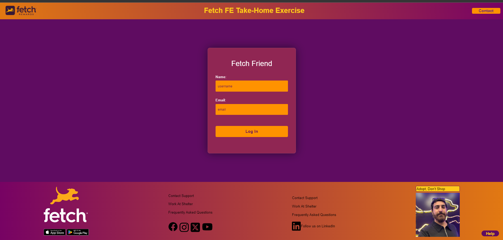
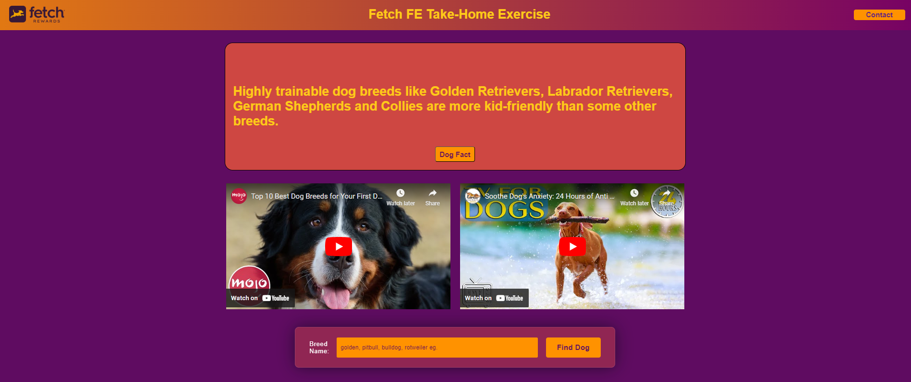
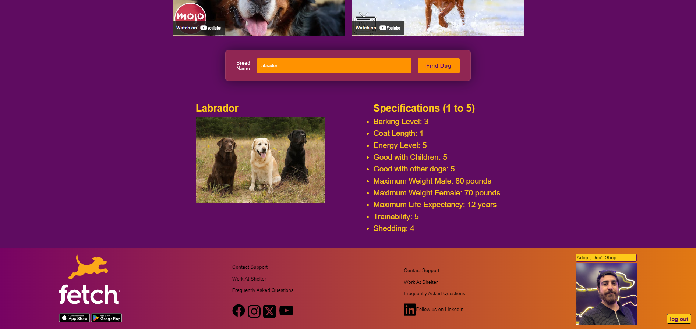
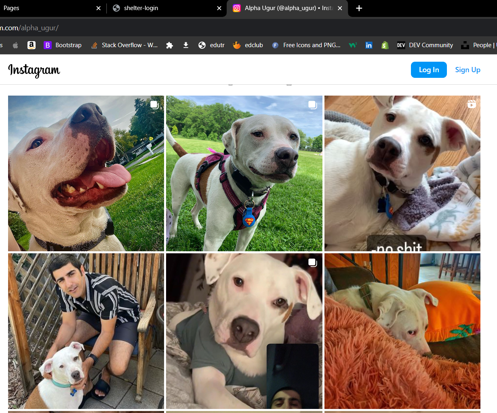
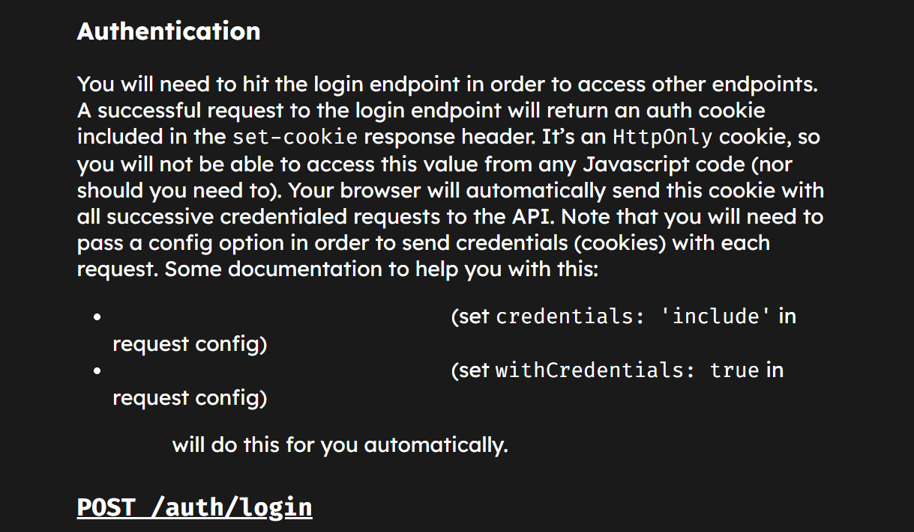
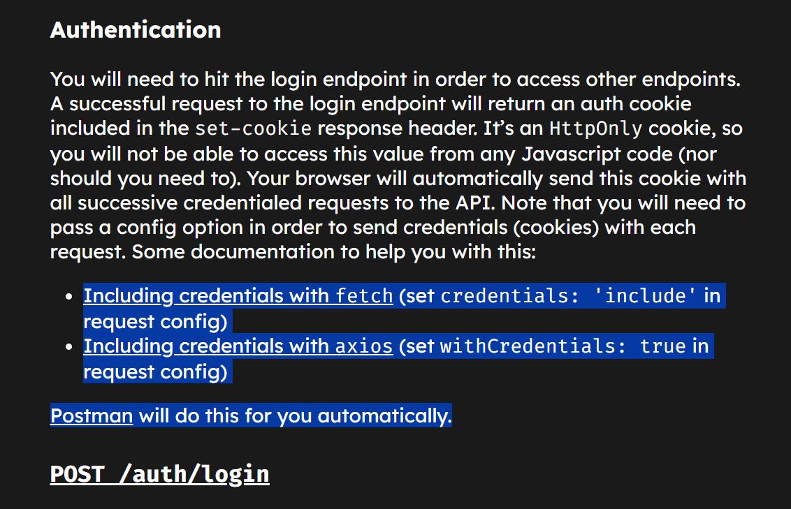
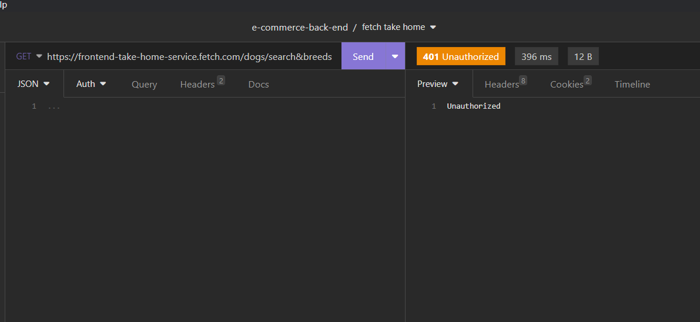

# GOSHELTER

## Description
This application help to why people should adopt dog from shelter.

## Usage
Input username and email than login. After successfuly login you will see why you should adopt a dog fact button and breed search. fact button fetching random dog fact to display and helping to geting informed about dogs. then search for breeds help what breed you should have and showing some specifications about selected breed.Also you will see two video that 10 most breeds and tv for dogs when you are not home and if you have Anxiety dog.

Screenshot of Login page: 

Screenshot of Dogfact: 

Screenshot of Find Breed: 

Screenshot of Adopt button. If you click here you will directed to my dog page that i adopt from shelter: 

Screenshot of my dog ALpha instagram page: 

## For Future Development
* Responsive design for all screen size with mediquery and simplification the codes to render faster on online.
* Appearance improvement for buttons and hovering links and elements.
* Dark mode for better vision on night or for people who likes dark mode.
* Better search with API based on the ZIP Codes, City, State, Age and more.

Deployed Site: [Link](https://cumauu73.github.io/fetch-fe-shelter/) 

## Problems while processing
* I was trying to fetch data from URL but getting hard time then i reilazed supported webside has a link color and background color same. on the image you can not see links 

* But when you higlighted the page you can see the link they provided

* So I had to remove that part of code so it will not show up in production site.
* Also having hard times for autorization

## Contact Information
* Potfoli: [cumaugur.com](https://www.cumaugur.com) 
* Email: cumauguur@gmail.com
* GitHub: cumauu73